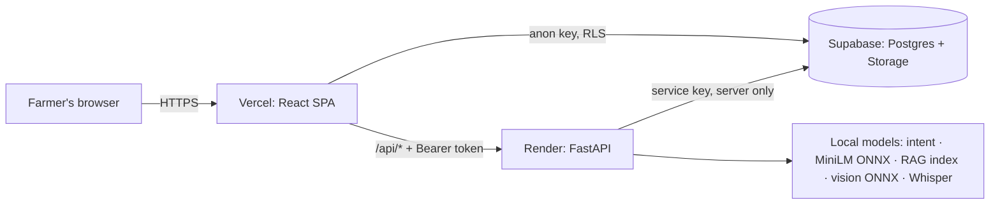

# 🌾 FarmerAssist — agriculture assistant for Tamil Nadu farmers

FarmerAssist is a web chatbot, styled after WhatsApp, for farmers in Tamil Nadu. Farmers can:

- ask farming questions in **English, Tamil or Tanglish** (Tamil typed in English letters);
- send a **leaf photo**;
- **speak** a question.

It answers in the same language, only about agriculture, and only from **official sources**, with the source link shown.
There is **no paid LLM API**: every model runs on our own server.

> ⚠️ **Preliminary guidance only.**
> - Knowledge comes from the TNAU Agritech Portal. Every record is marked *"official source – pending expert review"*.
> - Photo results are labelled *"Preliminary AI prediction"*. They are not a diagnosis.
> - Farmers should confirm products and doses with their local agriculture officer.

> ℹ️ **WhatsApp status:** this is the web demo of the FarmerAssist WhatsApp chatbot. Live WhatsApp integration is
> temporarily unavailable because the Meta WhatsApp Cloud API demo credits have ended.

---

## Contents
1. [Overview](#1-overview)
2. [Tech stack (exact versions)](#2-tech-stack-exact-versions)
3. [Architecture](#3-architecture)
4. [Project structure](#4-project-structure)
5. [Setup from zero](#5-setup-from-zero)
6. [Environment variables](#6-environment-variables)
7. [Run locally](#7-run-locally)
8. [Models (setup and rebuild)](#8-models-setup-and-rebuild)
9. [Datasets](#9-datasets)
10. [Train the image model](#10-train-the-image-model)
11. [Tests](#11-tests)
12. [Deployment (Supabase → Render → Vercel)](#12-deployment)
13. [Troubleshooting](#13-troubleshooting)
14. [I HAVE NOT TOUCHED THIS PROJECT FOR 3 MONTHS](#14-i-have-not-touched-this-project-for-3-months)
15. [Production checklist](#15-production-checklist)
16. [Limitations](#16-limitations)
17. [Data sources and licences](#17-data-sources-and-licences)

---

## 1. Overview

| Feature | How it works |
|---|---|
| **Login** | One demo account, checked **server-side**. The password is stored only as a PBKDF2 hash. The server returns a signed session token that lasts 12 hours. |
| **Chat** | Language detection, then Tamil/Tanglish → English normalisation, crop detection, intent classifier and a domain guard. Answers come from retrieval over verified knowledge, using fixed templates, **verbatim** excerpts and sources. |
| **Photo** | JPEG/PNG/WEBP up to 5 MB, then quality checks, then MobileNetV3-Small (ONNX), then a confidence gate. The result includes knowledge for the predicted condition and the model and dataset version. |
| **Voice** | faster-whisper (Tamil/English) transcribes speech into the chat pipeline. On Render free (too little RAM for Whisper) the microphone uses the browser's speech recognition instead (Chrome/Edge/Android, Tamil or English). |
| **History** | Supabase (Postgres + private Storage). RLS gives each browser its own anonymous Supabase user. |
| **Limits** | Enforced server-side: chat 20/min, image 5/min, voice 5/min, login 5/min. The UI shows a countdown and keeps the typed text. |

Nothing is invented. If no verified record clears the similarity threshold, the bot says:
*"I don't have enough verified information to answer that safely…"*.

## 2. Tech stack (exact versions)

**Frontend** (`frontend/package.json`; installed versions are in `package-lock.json`):

| Package | Version |
|---|---|
| react / react-dom | 18.3.1 |
| vite | 5.4.21 |
| @vitejs/plugin-react | 4.7.0 |
| @supabase/supabase-js | 2.117.1 (lazy-loaded) |

Styling is plain CSS with design tokens (`frontend/src/styles`). There is no UI framework, router library or state library.

**Backend** (Python 3.13.1; `backend/requirements.txt`, all pinned):

| Package | Version | Package | Version |
|---|---|---|---|
| fastapi | 0.141.1 | numpy | 2.5.3 |
| uvicorn[standard] | 0.53.0 | scipy | 1.18.1 |
| pydantic | 2.13.5 | scikit-learn | 1.9.1 (pinned: intent model pickle) |
| pydantic-settings | 2.15.0 | joblib | 1.6.0 |
| python-multipart | 0.0.32 | onnxruntime | 1.30.0 |
| slowapi | 0.1.10 | tokenizers | 0.23.2 |
| python-dotenv | 1.2.3 | opencv-python-headless | 5.0.0.93 |
| supabase | 2.31.0 | | |

Optional and development packages:

- **Voice** (`backend/requirements-voice.txt`): faster-whisper 1.2.1.
- **Development** (`backend/requirements-dev.txt`): pytest 9.1.1, pytest-asyncio 1.4.0, httpx 0.28.1, huggingface_hub 1.32.0.

**Offline training** (`ai/requirements-train.txt`, separate venv `ai/.venv-train`):

| Package | Version |
|---|---|
| torch | 2.11.0+cu128 |
| torchvision | 0.26.0+cu128 |
| onnx | 1.23.0 |
| onnxruntime | 1.30.0 |
| numpy | 2.5.2 |
| Pillow | 12.3.0 |
| scikit-learn | 1.9.1 |
| PyYAML | 6.0.3 |

**Tools and hosting:**

- Node.js 24.19.0 (Node 20+ works).
- Supabase (Postgres, Storage, anonymous Auth).
- Render (free web service) and Vercel (static SPA).

**Models:**

| Model | Detail |
|---|---|
| Embeddings | sentence-transformers/all-MiniLM-L6-v2, int8 ONNX |
| Intent | TF-IDF (character + word) + embedding → LogisticRegression |
| Vision | MobileNetV3-Small (ImageNet-pretrained, fine-tuned), exported to ONNX |
| Speech | Whisper "small" (faster-whisper / CTranslate2) |

## 3. Architecture



**Chat pipeline:**

```
text / voice ─► language detection (Tamil · Tanglish · English · mixed)
             ─► Tamil/Tanglish → English normalisation (lexicons; the UI always shows the original text)
             ─► crop detection ─► MiniLM sentence embedding (ONNX)
             ─► intent classifier ─► domain guard (refuse / clarify / answer)
             ─► retrieval: NumPy cosine over verified records (crop/topic aware, threshold 0.61, naming-term check)
             ─► fixed template + verbatim excerpt + source links (no free-text generation)
```

**Photo pipeline:**

```
photo ─► content sniffing (real JPEG/PNG/WEBP, ≤ 5 MB) ─► OpenCV decode ─► quality checks (size, blur, exposure, plant pixels)
      ─► MobileNetV3-Small ONNX (supported crop classes + "unsupported") ─► confidence ≥ 0.60 or "uncertain"
      ─► matching official record (only if its title names that disease) ─► response with model_name / model_version / dataset_version
```

**Login flow:**

```
/login ─► POST /api/auth/login {username,password} ─► PBKDF2 verify (constant time) ─► HMAC-signed token (12 h)
       ─► token in localStorage ─► "Authorization: Bearer" on chat/image/voice ─► 401 → back to /login
```

## 4. Project structure

```
frontend/                   React + Vite SPA
  src/Root.jsx              tiny router: /login and / (chat)
  src/components/           LoginPage, Sidebar, ChatWindow, Composer, DemoNotice, AboutDialog, …
  src/hooks/                useAssistant (send/retry/cooldown), useCooldown, useConversations, …
  src/services/             http.js (Bearer, errors, Retry-After), authService, botService, storageService, supabase
  vercel.json               SPA rewrite + security headers
backend/
  app/main.py               FastAPI app, CORS, security headers, rate limiter
  app/api/routes/           auth, chat, image, voice, health
  app/security/             auth (PBKDF2, tokens), rate limiting, upload validation
  app/nlp/ embeddings/ rag/ vision/ voice/ services/ database/ schemas/ config/
  models/                   runtime artifacts (committed): intent/, embedding/, knowledge/, lexicon/, vision/
ai/
  training/                 train_intent.py, train_vision.py, evaluate_vision.py, export_model.py, training_config.yaml, download_models.py
  evaluation/               evaluate_intent.py, evaluate_retrieval.py, class_metrics.py, confusion_matrix.py, field_test.py
  requirements-train.txt    GPU training environment
datasets/
  vision/                   README.md, SOURCES.md, metadata/ (manifest, classes, sources, licences, report); images git-ignored
  nlp/ tanglish/ knowledge/ …  intent training data, lexicons, dataset docs
data/                       knowledge pipeline: sources/ → raw/ (ignored) → processed/ → verified/
scripts/
  vision/                   dataset pipeline (download → validate → dedupe → manifest → balance → split → report)
  collect_sources.py …      knowledge pipeline, import_supabase.py, hash_password.py
supabase/migrations/        schema + RLS + buckets, knowledge provenance, prediction versioning
tests/                      pytest (auth, chat, language, intent, RAG, image, voice, security, limits, health, Supabase)
reports/                    intent_report.json, vision_report.{json,md}, dataset_audit.md
docs/                       api.md, DEPLOYMENT.md, architecture.md, dataset.md
render.yaml                 Render Blueprint (backend)
```

## 5. Setup from zero

Install the prerequisites:

- Git
- Python **3.13** (python.org, with "Add to PATH")
- Node.js **20+**
- (training only) an NVIDIA GPU with a recent driver

The commands below are for Windows Git Bash. In PowerShell, replace `/` with `\`.

```bash
git clone https://github.com/<you>/farmerassist.git && cd farmerassist

# Backend
python -m venv backend/.venv
backend/.venv/Scripts/pip install -r backend/requirements-dev.txt
backend/.venv/Scripts/pip install -r backend/requirements-voice.txt    # optional: voice
cp backend/.env.example backend/.env

# Create the login secrets (asks for the password, prints the hash + a session secret)
backend/.venv/Scripts/python scripts/hash_password.py                  # paste both lines into backend/.env, set DEMO_USERNAME

# Frontend
cd frontend && npm ci && cp .env.example .env && cd ..
```

Then fill in `backend/.env` and `frontend/.env` using [§6](#6-environment-variables) and
[SETUP_CREDENTIALS.md](SETUP_CREDENTIALS.md) (Supabase keys and one-time Supabase setup).

The runtime models are committed under `backend/models/`, so chat and photo analysis work straight after cloning.
Rebuilding the models is optional; see [§8](#8-models-setup-and-rebuild).

## 6. Environment variables

**Backend** (`backend/.env` locally; the Render Environment tab in production):

| Variable | Required | Default | Purpose |
|---|---|---|---|
| `ENVIRONMENT` | – | `development` | `production` disables `/docs` and forbids `*` CORS |
| `LOG_LEVEL` | – | `INFO` | logging level |
| `CORS_ORIGINS` | prod | localhost:5173 | allowed browser origins, comma-separated, no trailing slash |
| `TRUST_PROXY_HEADERS` | prod | `false` | `true` on Render so rate limits are per client |
| `SUPABASE_URL` | yes* | – | `https://<ref>.supabase.co` |
| `SUPABASE_ANON_KEY` | yes* | – | publishable key |
| `SUPABASE_SERVICE_ROLE_KEY` | yes* | – | **secret key, backend only** |
| `STORAGE_BUCKET_NAME` | – | `farmer-images` | photo bucket |
| `DEMO_USERNAME` | **yes** | – | login name |
| `DEMO_PASSWORD_HASH` | **yes** | – | from `scripts/hash_password.py`. **Never the plain password.** |
| `SESSION_SECRET` | **yes** | – | at least 32 random characters; signs tokens (changing it logs everyone out) |
| `SESSION_TTL_HOURS` | – | `12` | token lifetime |
| `RATE_LIMIT_CHAT` / `_IMAGE` / `_VOICE` / `_LOGIN` | – | `20/minute` / `5/minute` / `5/minute` / `5/minute` | server-side limits |
| `RETRIEVAL_SIMILARITY_THRESHOLD` | – | `0.61` | minimum similarity to answer (calibrated) |
| `IMAGE_CONFIDENCE_THRESHOLD` | – | `0.60` | below this the photo is "uncertain" |
| `VOICE_ENABLED` | – | `false` | `true` needs `requirements-voice.txt` and about 1 GB RAM |
| `VOICE_MODEL_SIZE` | – | `small` | Whisper size |

\* Without the Supabase keys the API still answers, but nothing is saved server-side.
If the three login variables are missing, login **fails closed**: every attempt returns 503.

**Frontend** (`frontend/.env` locally; Vercel Environment Variables in production). Every `VITE_*` value is **public**,
because it ends up in the browser bundle:

| Variable | Purpose |
|---|---|
| `VITE_API_BASE_URL` | Render URL in production. Leave it empty locally, because Vite proxies `/api`. |
| `VITE_SUPABASE_URL`, `VITE_SUPABASE_ANON_KEY` | Supabase project URL and **publishable** key only |
| `VITE_USE_BACKEND` | `false` = offline demo mode (no login, local greeting replies) |
| `BACKEND_PROXY_TARGET` | dev server only (default `http://127.0.0.1:8000`) |

Login credentials are **never** set in the frontend.

## 7. Run locally

```bash
backend/.venv/Scripts/python backend/run.py         # API → http://127.0.0.1:8000/api/health/ready
cd frontend && npm run dev                          # UI  → http://localhost:5173  (redirects to /login)
```

Log in with the demo account configured in `backend/.env`.

Production build check: `cd frontend && npm run build && npm run preview`.

## 8. Models (setup and rebuild)

The runtime artifacts are committed, so you normally do nothing here. Rebuild them offline, never during requests:

| Model | Command | Output |
|---|---|---|
| Embedding (MiniLM ONNX) | `backend/.venv/Scripts/python ai/training/download_models.py` | `backend/models/embedding/` |
| Intent classifier | `backend/.venv/Scripts/python ai/training/train_intent.py` | `backend/models/intent/intent_model.joblib`, `reports/intent_report.json` |
| Intent evaluation | `backend/.venv/Scripts/python ai/evaluation/evaluate_intent.py` | test-split accuracy |
| Retrieval threshold | `backend/.venv/Scripts/python ai/evaluation/evaluate_retrieval.py` | calibration report |
| Vision model | see [§10](#10-train-the-image-model) | `backend/models/vision/` |
| Whisper | downloaded automatically on the first voice request (`VOICE_ENABLED=true`) | HF cache |

Rebuild the knowledge base (official pages; robots.txt is respected, with a 2 s delay between requests):

```bash
P=backend/.venv/Scripts/python
$P scripts/collect_sources.py targeted && $P scripts/collect_sources.py fetch
$P scripts/clean_knowledge.py && $P scripts/deduplicate.py && $P scripts/validate_knowledge.py
$P scripts/build_knowledge_index.py          # → backend/models/knowledge/
$P scripts/import_supabase.py                # optional: copy verified records to Supabase
```

## 9. Datasets

See [datasets/vision/README.md](datasets/vision/README.md) and [datasets/vision/SOURCES.md](datasets/vision/SOURCES.md).

- Images come only from sources licensed **CC0 1.0 / CC BY 4.0**: PlantVillage, PlantDoc, and the Mendeley rice, chilli and banana sets.
- Each download is SHA-256 checked, and every image's source and licence is recorded in `datasets/vision/metadata/manifest.csv`.
- Images themselves (about 2 GB) are **not in git**. Rebuild them with:

```bash
backend/.venv/Scripts/python scripts/vision/build_dataset.py     # download → validate → dedupe → manifest → balance → split → report
```

`datasets/vision/metadata/dataset_report.md` records:

- class counts;
- duplicates removed;
- **train↔test leakage**, which must be 0 because splits are group-aware.

## 10. Train the image model

```bash
# one-time: GPU training environment
python -m venv ai/.venv-train
ai/.venv-train/Scripts/pip install torch==2.11.0 torchvision==0.26.0 --index-url https://download.pytorch.org/whl/cu128
ai/.venv-train/Scripts/pip install -r ai/requirements-train.txt

T=ai/.venv-train/Scripts/python
$T ai/training/train_vision.py        # → ai/models/vision/staging/ (model.pt, classes.json, model_config.json, training_metadata.json)
$T ai/training/evaluate_vision.py     # metrics per source, unseen-crop rejection, quality gates → reports/vision_report.md
$T ai/training/export_model.py        # ONLY if the gates pass: ONNX + parity check → backend/models/vision/
backend/.venv/Scripts/python -m pytest tests/test_image.py
```

Settings live in `ai/training/training_config.yaml`: epochs, augmentation, threshold and quality gates.

The export refuses to run unless all of these pass:

- test macro-F1 ≥ 0.85;
- unseen-crop rejection ≥ 0.70;
- ONNX output matches PyTorch.

Classes with F1 below 0.60 are listed as weak in the model card.

Test the model on **your own field photos** before trusting it:

1. Put the photos in `datasets/vision/field_test/<class_name>/`.
2. Run `backend/.venv/Scripts/python ai/evaluation/field_test.py`.

Current model results: [reports/vision_report.md](reports/vision_report.md).

## 11. Tests

```bash
backend/.venv/Scripts/python -m pytest              # whole suite
```

The suite covers:

- auth (login, hashing, token tamper and expiry, logout);
- chat in all three languages, intent and RAG;
- image security and real-model predictions;
- voice (skipped unless voice is enabled);
- security headers, CORS and rate limits;
- health;
- live Supabase (skipped without keys).

## 12. Deployment

Full step-by-step guide: **[docs/DEPLOYMENT.md](docs/DEPLOYMENT.md)**. Short version:

1. **Supabase:**
   - In the SQL Editor, run every file in `supabase/migrations/` in name order. All of them are idempotent: safe on a new project and safe to re-run on an existing one.
   - Enable anonymous sign-ins.
   - Run `scripts/import_supabase.py`.
2. **Render:**
   - Create it via New → Blueprint → this repo, which uses `render.yaml`.
   - Enter `CORS_ORIGINS`, the Supabase keys, `DEMO_USERNAME`, `DEMO_PASSWORD_HASH` and `SESSION_SECRET`.
   - Check: `https://<service>.onrender.com/api/health/ready`.
   - **Or Railway** instead of Render: Root Directory `backend`, config `/backend/railway.json`, same variables
     (see docs/DEPLOYMENT.md §3b). Both hosts start the API with `python run.py`.
3. **Vercel:**
   - Import the repo with Root Directory `frontend`.
   - Set `VITE_API_BASE_URL` (the Render URL), `VITE_SUPABASE_URL` and `VITE_SUPABASE_ANON_KEY`.
   - Put the Vercel URL into Render's `CORS_ORIGINS`.
4. Open the Vercel URL, then `/login`. Log in, ask in all three languages, send a photo, and reload to see history.

Render free sleeps after 15 minutes idle, so the first request then takes 30–60 s. Whisper is off there (it needs about 1 GB RAM), so the microphone uses the browser's speech recognition.

## 13. Troubleshooting

| Symptom | Cause | Fix |
|---|---|---|
| Login says "Login is not configured on the server" (503) | `DEMO_USERNAME`, `DEMO_PASSWORD_HASH` or `SESSION_SECRET` is missing, or the secret is shorter than 32 characters | Run `scripts/hash_password.py`, set all three, restart the API |
| Login says "Incorrect username or password" with the right password | The hash was made from a different password, or `$` characters were mangled when pasting | Re-run `hash_password.py`; in Render, paste the value exactly |
| Logged out after a redeploy | `SESSION_SECRET` changed, or 12 h passed | Log in again (expected) |
| "You've reached the request limit. Try again in N seconds." | Server-side rate limit (chat 20/min, image 5/min, login 5/min) | Wait for the countdown. The typed text is kept. |
| Browser console shows a CORS error | `CORS_ORIGINS` doesn't exactly match the frontend URL | Use the exact origin, `https://…vercel.app`, with no trailing slash, then redeploy |
| First request takes about 60 s on Render | The free instance was asleep | Normal. Open `/api/health` first to wake it. |
| Photo always "uncertain" | Blurry, dark or close-up photo; a crop the model doesn't support; or confidence below 0.60 | Retake the photo in daylight showing one whole leaf. See the supported classes in `backend/models/vision/labels.json`. |
| Photo returns `model_unavailable` | `backend/models/vision/crop_disease.onnx` or `labels.json` is missing | Restore them from git (`git checkout -- backend/models/vision`) or re-run `export_model.py` |
| Voice says it isn't available | The server has no Whisper (`VOICE_ENABLED=false`) and the browser has no speech recognition (e.g. Firefox) | Use Chrome or Edge; or install `requirements-voice.txt` and set `VOICE_ENABLED=true` (needs about 1 GB RAM) |
| `InconsistentVersionWarning` / intent model fails to load | scikit-learn version differs from 1.9.1 | `pip install -r backend/requirements.txt`, or retrain with `train_intent.py` |
| History not saved, and "Supabase" appears in the console | Wrong or missing `VITE_SUPABASE_*`, anonymous sign-ins off, or migrations not run | Follow SETUP_CREDENTIALS.md |
| `PGRST204` on image_predictions | The prediction-versioning migration hasn't run | Run `supabase/migrations/20260924020000_prediction_versioning.sql` (the app falls back meanwhile) |
| Supabase times out or reports "JWT issued in the future" | The PC clock is wrong | Windows Settings → Time → Sync now |
| Refreshing `/login` on Vercel gives 404 | The SPA rewrite is missing | Keep `frontend/vercel.json` and set Root Directory to `frontend` |
| Training error 1455 / DataLoader crash on Windows | Too many workers or too little virtual memory | Set `data.num_workers: 2` (or 0) in `training_config.yaml` |
| `CUDA out of memory` while training | The 4 GB GPU is too small for the batch size | Lower `training.batch_size` in `training_config.yaml` |
| Python interpreter not found in the IDE | The venv doesn't exist yet | Create `backend/.venv` (§5), then select `backend/.venv/Scripts/python.exe` |

## 14. I HAVE NOT TOUCHED THIS PROJECT FOR 3 MONTHS

Go through these in order:

1. **Secrets**:
   - Rotate the Supabase secret key: Dashboard → API Keys. Update `backend/.env` and Render.
   - Consider a new demo password: `scripts/hash_password.py`, then update `DEMO_PASSWORD_HASH` and `SESSION_SECRET` in Render.
2. **Supabase**:
   - Free projects **pause after about 1 week of inactivity**. Dashboard → Restore project.
   - Then check `https://<service>.onrender.com/api/health/ready` → `"database": "connected"`.
3. **Render / Vercel**:
   - Check that both services still exist and the last deploy is green.
   - Trigger a manual deploy of `main`.
4. **Local environment**:
   - `git pull`
   - `backend/.venv/Scripts/pip install -r backend/requirements-dev.txt`
   - `cd frontend && npm ci`
5. **Tests**: `backend/.venv/Scripts/python -m pytest`. Everything should pass or skip. Fix before changing anything else.
6. **Run locally** (§7), then log in, ask one English, one Tamil and one Tanglish question, and send one photo.
7. **Dependencies**:
   - Upgrade only on purpose, one group at a time, and re-run the tests.
   - scikit-learn upgrades **require** `train_intent.py`.
   - `npm audit` for the frontend.
8. **Knowledge freshness**:
   - Official advice (pesticides, schemes) changes.
   - Re-run the knowledge pipeline (§8), check `reports/dataset_audit.md`, then run `import_supabase.py`.
9. **Model**:
   - Read `reports/vision_report.md`.
   - Add real field photos to `datasets/vision/field_test/` and run `field_test.py`.
10. **Clock**: if Supabase shows JWT or time errors, sync the Windows clock.

## 15. Production checklist

- [ ] `git ls-files | grep -i "\.env$"` prints nothing, and `git check-ignore backend/.env frontend/.env` prints both
- [ ] No secret in the frontend bundle: `grep -rE "sb_secret_[A-Za-z0-9]" frontend/dist` finds nothing (bare `sb_secret_` is only the key-prefix guard)
- [ ] Render: `ENVIRONMENT=production`, `TRUST_PROXY_HEADERS=true`, `CORS_ORIGINS` = the exact Vercel URL
- [ ] Render: `DEMO_USERNAME`, `DEMO_PASSWORD_HASH` and `SESSION_SECRET` set; login works; a wrong password gets 401
- [ ] `/docs` returns 404 in production
- [ ] All Supabase migrations applied; anonymous sign-ins on; buckets private
- [ ] `/api/health/ready` shows the database connected, the intent/embedding/vision models loaded and the knowledge count above 0
- [ ] Chat works in English, Tamil and Tanglish, with sources shown
- [ ] Photo returns a "Preliminary AI prediction" with a model version; a non-plant photo returns "uncertain"
- [ ] The 429 countdown appears after the limit, and the text is kept
- [ ] The WhatsApp demo notice is visible once and dismissible
- [ ] pytest suite passes; `npm run build` succeeds

## 16. Limitations

- **Single demo account.** Everyone shares one login, and logout revocation is in memory, so it is forgotten on restart. Tokens still expire after 12 h. Real per-farmer login should move to Supabase Auth (phone OTP).
- **Knowledge.** The records are TNAU Agritech Portal pages, marked *pending expert review*. Some crops, and some tomato diseases, have no official record, so no advice is shown for them.
- **Image model.** It supports only the classes in `labels.json`. PlantVillage lab accuracy is much higher than field accuracy, and both are reported separately. Some unseen plants are still misclassified.
- **Voice.** On Render free it uses the browser's speech recognition (Chrome sends the audio to Google; Firefox has none). Tamil speech recognition quality depends on audio quality.
- **WhatsApp.** The Cloud API integration is paused (Meta demo credits ended). This web app is the demo.

## 17. Data sources and licences

- **Knowledge:** TNAU Agritech Portal (Tamil Nadu Agricultural University). Collected politely, with attribution; every record stores its URL and retrieval date. Ask TNAU before any commercial use.
- **Images:** PlantVillage (CC0 1.0), PlantDoc (CC BY 4.0), RiceLeafBD (CC BY 4.0), Rice Leaf Disease Image Samples (CC BY 4.0), Chilli Leaf Disease Image Dataset (CC BY 4.0), Banana Leaf Disease Images (CC BY 4.0). Citations are in [datasets/vision/SOURCES.md](datasets/vision/SOURCES.md).
- **Models:** all-MiniLM-L6-v2 (Apache-2.0); MobileNetV3 ImageNet weights (torchvision, BSD-3); Whisper / faster-whisper (MIT).
